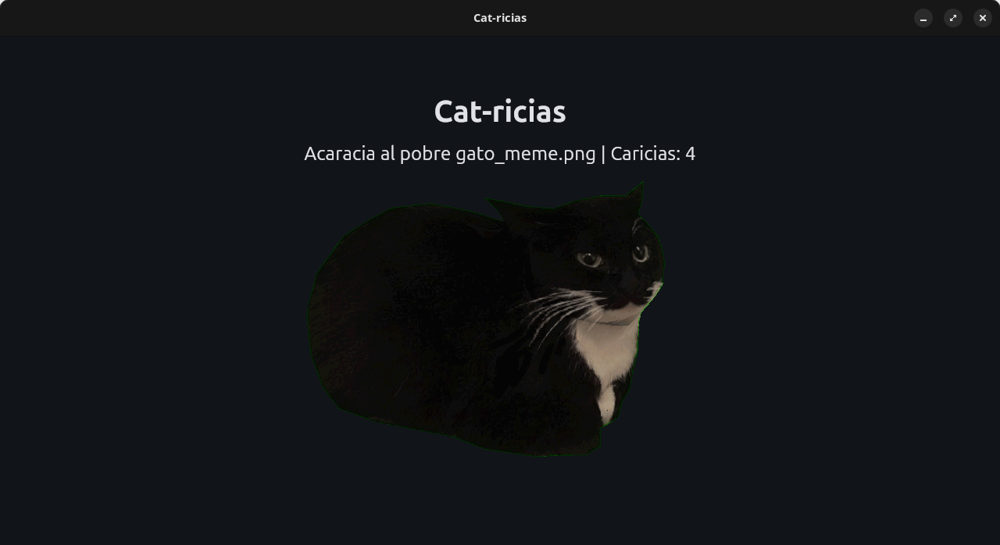

## CAT-RICIAS

Acaricia al gato_meme.png, de lo contrario, seguira sonando música triste, porque él está triste, y tú lo estarás también.

Pet the cat_meme.png, otherwise sad music will continue to play, because he is sad, and you will be too.

### Instalar/Installation

Esta app soporta el sistema operativo superior, **Linux**, [puedes simplemente descargar el AppImage](https://github.com/racsuline/cat-ricias/releases)

Para otros sistemas operativos (los malos), puedes hacer `git clone` del repo y ejecutarlo sin más; es un programa chikito.
Se requieren **Flet** y **Flet_audio** para Python.

This app does support the superior operating system, Linux, [you can just download the AppImage](https://github.com/racsuline/cat-ricias/releases)

For other operating systems (the bad ones) you can just `git clone` this and run it, is a very smol program.
**Flet** and **Flet_audio** for python are required.

### About the program...

You can fork it, clone it, and do whatever you want with it, but be aware, the code... is super complicated... I can't even understand it myself, and I'm a super pro-pro-programmer level 150. I have an iq of 2 and my mom said that it was I was a weird thing, so I assume I'm superior.

plop.

